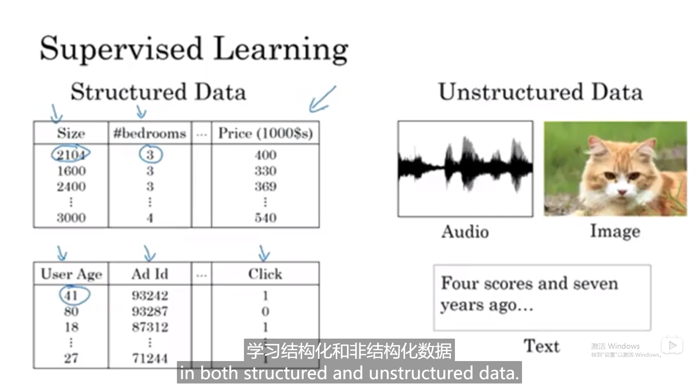
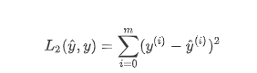

[toc]


# 1神经网络概述

## **目的**：
*主要是为了提取不那么明显的特征*


## **常用例子**
：audio/文字都可以当成有序的时间序列所以是RNN来处理





处理数据源的格式，结构化每一个的意思


## **各个网络**算力对比

近年能表现这么好得益于scale（数据集），数据和网络参数的/训练集不大的时候svm可能更好，但是训练集大了之后large NN，得益于（技术支持）---算法sigmoid的斜率低导致学习慢-->Relu斜率不变就快了很多。


## 二分分类


x属于nx维度的向量，X有m个可用python拼起来


# 2 logistic回归

## 2.1 表达


w,b分开来看比较好这样就是


loss是对单，cost是对总的训练样本，找到合适的w，b来尽可能小。

对于logistics用（）^2只会更多局部最优解。

## 2.2 计算步骤：正向反向传播例子

对关心的变量的导数传导）


反向例子（da代表a对最终变化率的影响）


沿着红色箭头走最好因为前变化率可在后面用到

### logistic反向传播的单个例子


### m个例子


1->m需要一个for，dw1->dwn需要一个for

#### 避免for loop


### **把第一层for也去掉的vectorization**


拼成矩阵dot即可


外面那层循环还是不能去，for n次梯度下降，dw指的是所有样本对一个w参数的估计

## 2.3 附录：

### python的broadcasting 


使得代码简洁-->自动扩充矩阵

### python的rank 1 array

不要报错

```python
a = np.random.randn(5,1)
a = np.random.randn(5)
a.shape = 
```


### 关于logistics回归的cost函数


假设m个样本都是独立同分布，使得cost最小==最大似然估计label

# 3. L1W1作业

## 3.1 使用numpy构建基本函数

**你需要记住的内容：** -np.exp（x）适用于任何np.array x并将指数函数应用于每个坐标 -sigmoid函数及其梯度 -image2vector通常用于深度学习 -np.reshape被广泛使用。 保持矩阵/向量尺寸不变有助于我们消除许多错误。 -numpy具有高效的内置功能 -broadcasting非常有用

## 3.2 向量化

```
x1 = [9, 2, 5, 0, 0, 7, 5, 0, 0, 0, 9, 2, 5, 0, 0]
x2 = [9, 2, 2, 9, 0, 9, 2, 5, 0, 0, 9, 2, 5, 0, 0]

### VECTORIZED DOT PRODUCT OF VECTORS ###
tic = time.process_time()
dot = np.dot(x1,x2)
toc = time.process_time()
print ("dot = " + str(dot) + "\n ----- Computation time = " + str(1000*(toc - tic)) + "ms")

### VECTORIZED OUTER PRODUCT ###
tic = time.process_time()
outer = np.outer(x1,x2)
toc = time.process_time()
print ("outer = " + str(outer) + "\n ----- Computation time = " + str(1000*(toc - tic)) + "ms")

### VECTORIZED ELEMENTWISE MULTIPLICATION ###
tic = time.process_time()
mul = np.multiply(x1,x2)
toc = time.process_time()
print ("elementwise multiplication = " + str(mul) + "\n ----- Computation time = " + str(1000*(toc - tic)) + "ms")

### VECTORIZED GENERAL DOT PRODUCT ###
tic = time.process_time()
dot = np.dot(W,x1)
toc = time.process_time()
print ("gdot = " + str(dot) + "\n ----- Computation time = " + str(1000*(toc - tic)) + "ms")
```

**注意** 不同于`np.multiply()`和`*` 操作符（相当于Matlab / Octave中的 `.*`）执行逐元素的乘法，`np.dot()`执行的是矩阵-矩阵或矩阵向量乘法，

### 实现L1,L2损失函数


```python
def L1(yhat, y):
    """
    Arguments:
    yhat -- vector of size m (predicted labels)
    y -- vector of size m (true labels)
    
    Returns:
    loss -- the value of the L1 loss function defined above
    """
    
    ### START CODE HERE ### (≈ 1 line of code)
    loss = np.sum(np.abs(y - yhat))
    ### END CODE HERE ###
    
    return loss
```



```python
def L2(yhat, y):
    """
    Arguments:
    yhat -- vector of size m (predicted labels)
    y -- vector of size m (true labels)
    
    Returns:
    loss -- the value of the L2 loss function defined above
    """
    
    ### START CODE HERE ### (≈ 1 line of code)
    loss = np.dot((y - yhat),(y - yhat).T)
    ### 
    实现了相乘相加的功能
    END CODE HERE ###
    
    return loss
```


**你需要记住的内容：** -向量化在深度学习中非常重要， 它保证了计算的效率和清晰度。 -了解L1和L2损失函数。 -掌握诸多numpy函数，例如np.sum，np.dot，np.multiply，np.maximum等。


# 4. L1W2作业  用神经网络思想实现Logistic回归

## 4.1 数据集维度，标准化


展示在行内


### 裁剪数组

[:,index]指的把行选完，选第几列。squeeze把维度为1的去掉 1*209 -->209


### 重塑训练和测试数据集

以便将大小（num_px，num_px，3）的图像展平为单个形状的向量(num_px ∗ num_px ∗ 3, 1)。

将维度为（a，b，c，d）的矩阵X展平为形状为(b∗c∗d, a)的矩阵X_flatten时的一个技巧

```python
X_flatten = X.reshape（X.shape [0]，-1）.T     ＃ 其中X.T是X的转置矩阵
```


标准化数据集

### 总结

- 找出数据的尺寸和维度（m_train，m_test，num_px等）
- 重塑数据集，以使每个示例都是大小为（num_px \ *num_px \* 3，1）的向量
- “标准化”数据

## 4.2 logistics架构


-    初始化模型参数
-    通过最小化损失来学习模型的参数
-    使用学习到的参数进行预测（在测试集上）
-    分析结果并得出结论

## 4.3 实现各算法

定义模型结构（例如输入特征的数量） 2.初始化模型的参数 3.循环：

-    计算当前损失（正向传播）
-    计算当前梯度（向后传播）
-    更新参数（梯度下降）

### 初始化模型参数


把w,b全部置0

- 辅助函数sigmoid
- 

### 前向和后向传播

注意：*是逐个元素相乘，dot是矩阵点乘法


#### 计算前后传播的A,cost,dw,db

```python
# GRADED FUNCTION: propagate

def propagate(w, b, X, Y):
    """
    Implement the cost function and its gradient for the propagation explained above

    Arguments:
    w -- weights, a numpy array of size (num_px * num_px * 3, 1)
    b -- bias, a scalar
    X -- data of size (num_px * num_px * 3, number of examples)
    Y -- true "label" vector (containing 0 if non-cat, 1 if cat) of size (1, number of examples)

    Return:
    cost -- negative log-likelihood cost for logistic regression
    dw -- gradient of the loss with respect to w, thus same shape as w
    db -- gradient of the loss with respect to b, thus same shape as b
    
    Tips:
    - Write your code step by step for the propagation. np.log(), np.dot()
    """
    
    m = X.shape[1]
    
    # FORWARD PROPAGATION (FROM X TO COST)
    ### START CODE HERE ### (≈ 2 lines of code)
    A = sigmoid(np.dot(w.T, X) + b)            # compute activation
    cost = -1 / m * np.sum(Y * np.log(A) + (1 - Y) * np.log(1 - A))         # compute cost
    ### END CODE HERE ###
    
    # BACKWARD PROPAGATION (TO FIND GRAD)
    ### START CODE HERE ### (≈ 2 lines of code)
    dw = 1 / m * np.dot(X, (A - Y).T)
    db = 1 / m * np.sum(A - Y)
    ### END CODE HERE ###
    assert(dw.shape == w.shape)
    assert(db.dtype == float)
    cost = np.squeeze(cost)
    assert(cost.shape == ())
    
    grads = {"dw": dw,
             "db": db}
    
    return grads, cost
```

`()`是空元组，此断言检查`cost`的形状是否为空元组。所以它检查`cost`是否是标量

因为是m个样本的平均值，让全局最优


#### 最小化损失函数

**练习：** 写下优化函数。 目标是通过最小化损失函数 J 来学习 w 和 b。 对于参数θ，更新规则为θ=θ−α dθ，其中α是学习率。

```python
# GRADED FUNCTION: optimize

def optimize(w, b, X, Y, num_iterations, learning_rate, print_cost = False):
    """
    This function optimizes w and b by running a gradient descent algorithm
    
    Arguments:
    w -- weights, a numpy array of size (num_px * num_px * 3, 1)
    b -- bias, a scalar
    X -- data of shape (num_px * num_px * 3, number of examples)
    Y -- true "label" vector (containing 0 if non-cat, 1 if cat), of shape (1, number of examples)
    num_iterations -- number of iterations of the optimization loop
    learning_rate -- learning rate of the gradient descent update rule
    print_cost -- True to print the loss every 100 steps
    
    Returns:
    params -- dictionary containing the weights w and bias b
    grads -- dictionary containing the gradients of the weights and bias with respect to the cost function
    costs -- list of all the costs computed during the optimization, this will be used to plot the learning curve.
    
    Tips:
    You basically need to write down two steps and iterate through them:
        1) Calculate the cost and the gradient for the current parameters. Use propagate().
        2) Update the parameters using gradient descent rule for w and b.
    """
    
    costs = []
    
    for i in range(num_iterations):
        
        
        # Cost and gradient calculation (≈ 1-4 lines of code)
        ### START CODE HERE ### 
        grads, cost = propagate(w, b, X, Y)
        ### END CODE HERE ###
        
        # Retrieve derivatives from grads
        dw = grads["dw"]
        db = grads["db"]
        
        # update rule (≈ 2 lines of code)
        ### START CODE HERE ###
        w = w - learning_rate * dw
        b = b - learning_rate * db
        ### END CODE HERE ###
        
        # Record the costs
        if i % 100 == 0:
            costs.append(cost)
        
        # Print the cost every 100 training examples
        if print_cost and i % 100 == 0:
            print ("Cost after iteration %i: %f" %(i, cost))
    
    params = {"w": w,
              "b": b}
    
    grads = {"dw": dw,
             "db": db}
    
    return params, grads, costs
```

迭代更新w,b并且最终返回一个最终的grads

### 用学习到的w,b预测

**练习：** 上一个函数将输出学习到的w和b。 我们能够使用w和b来预测数据集X的标签。实现`predict（）`函数。 预测分类有两个步骤： 1.计算Y^=A=σ(wTX+b) 2.将a的项转换为0（如果激活<= 0.5）或1（如果激活> 0.5），并将预测结果存储在向量“ Y_prediction”中。 如果愿意，可以在for循环中使用if / else语句。


### 总结

- 初始化（w，b）
- 迭代优化损失以学习参数（w，b）：
  -   计算损失及其梯度
  -   使用梯度下降更新参数
- 使用学到的（w，b）来预测给定示例集的标签

## 4.4 合并模型

### 整合初始化，优化迭代，预测


整合初始化，优化迭代，预测

```python
# Example of a picture that was wrongly classified.
index = 1
plt.imshow(test_set_x[:,index].reshape((num_px, num_px, 3)))
print ("y = " + str(test_set_y[0,index]) + ", you predicted that it is a \"" + classes[int(d["Y_prediction_test"][0,index])].decode("utf-8") +  "\" picture.")
```


### 绘制损失函数和梯度


## 4.5 分析总结

#### 学习率的选择

**提醒**： 为了使梯度下降起作用，你必须明智地选择学习率。 学习率α决定我们更新参数的速度。 如果学习率太大，我们可能会“超出”最佳值。 同样，如果太小，将需要更多的迭代才能收敛到最佳值。 这也是为什么调整好学习率至关重要。

让我们将模型的学习曲线与选择的几种学习率进行比较。 运行下面的单元格。 这大约需要1分钟。 还可以尝试与我们初始化要包含的“ learning_rates”变量的三个值不同的值，然后看看会发生什么。

```python
learning_rates = [0.01, 0.001, 0.0001]
models = {}
for i in learning_rates:
    print ("learning rate is: " + str(i))
    models[str(i)] = model(train_set_x, train_set_y, test_set_x, test_set_y, num_iterations = 1500, learning_rate = i, print_cost = False)
    print ('\n' + "-------------------------------------------------------" + '\n')

for i in learning_rates:
    plt.plot(np.squeeze(models[str(i)]["costs"]), label= str(models[str(i)]["learning_rate"]))

plt.ylabel('cost')
plt.xlabel('iterations')

legend = plt.legend(loc='upper center', shadow=True)
frame = legend.get_frame()
frame.set_facecolor('0.90')
plt.show()
```


- 不同的学习率会带来不同的损失，因此会有不同的预测结果。
- 如果学习率太大（0.01），则成本可能会上下波动。 它甚至可能会发散（尽管在此示例中，使用0.01最终仍会以较高的损失值获得收益）。
- 较低的损失并不意味着模型效果很好。当训练精度比测试精度高很多时，就会发生过拟合情况。
- 在深度学习中，我们通常建议你：
  -    选择好能最小化损失函数的学习率。
  -    如果模型过度拟合，请使用其他方法来减少过度拟合。 （我们将在后面的教程中讨论。）