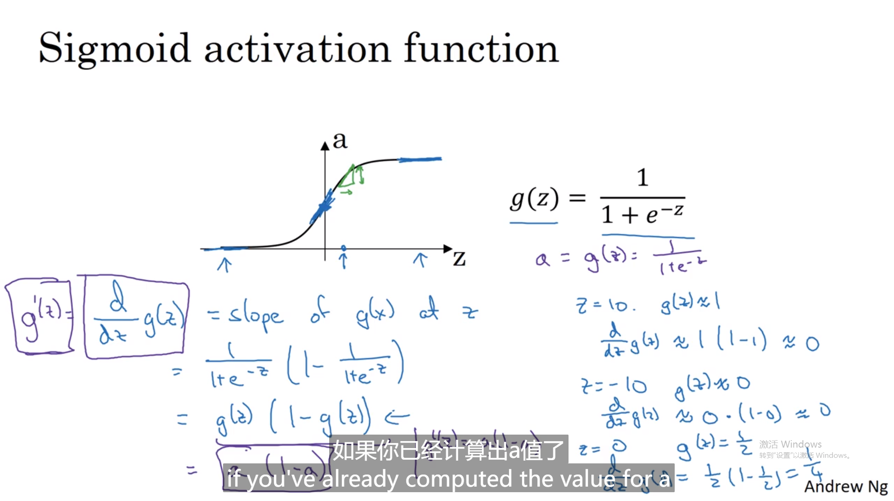

# 1. 神经网络概览

## 1.1 神经网络表示


看起来像是把logistics回归重复了2次


两层神经网络构图，一层隐藏层，w从上至下是表示有多少个unit在隐藏层


### 向量化表示方法


Z^[1]^是指的层数第一个隐藏层，从左至右遍历样本，从上至下遍历参数

由单个到多个样本的矩阵集成化，消去for loop


## 1.2 激活函数

**对比**，激活函数可以选sigmoid（其中一个二分0，1问题）/tanh（一般）（不适合数值大的，导数很小w-alpha*dw很没变化）


最常用relu函数，

leaking relu在z<0导数负的


几种激活函数的对比，

### 为什么要激活函数


这样relu

一直是线性还是线性--**恒等激活函数** ，不管多少层一直计算线性激活函数--不如直接去掉隐藏层

当回归问题比如房价，可以线性激活函数，隐藏层relu，tanh。或者输出激活用relu无负房价。

 

### 各种激活函数

### sigmoid



###  tanh 

### ReLU


## 1.3 神经网络的梯度下降算法


以上是梯度下降算法，重复更新权值和b

### 向前传播和向后传播

默认的A^[2]^是矩阵且最后用了sigmoid

keepdims为了保证矩阵n^[2]^*1,g[1]^1^是隐藏层的导数，n^[1]^*m,*是逐个元素乘积


## 1.4 理解反向传播

不需要计算dx，不是优化dx，因为x是固定的

  

 最后一行dz[1]的n[1]*n[1]是对于元素相乘


## 1.5 随机初始化权值


**不能**全部**初始化0**，正向传播一样，反向亦如此，，每一行都是一样的了


如果*100会导致激活函数处于**平缓段**，导数很小，减慢学习速率。因此w是**较小的随机数**

# 2. L1W3作业 用1层隐藏层的神经网络分类二维数据

## 2.1 数据集


scatter选择X第一行，第二行，将Y变成一整行的数据（和X相同）

看shape


## 2.2 简单logistic效果


注意`ravel()`后一维数组，由于数据集不是线性可分类的，因此逻辑回归效果不佳

## 2.3 一层hidden的神经网络模型


### 总步骤

- 定义神经网络（输入，隐藏单元数目）

- 初始化模型参数

- 循环：前向传播，计算损失，后向传播获得梯度，更新参数

整合`nn_model()`函数

#### 定义神经网络


#### 初始化模型的参数


初始化`w1`矩阵`（n_h, n_x）,w2`注意维度，b不需要randn

#### 循环

**前向传播**


cache以供后面方便

实现`compute_cost（）`以**计算损失J的值**


**反向传播**，实现函数`backward_propagation（）`


```python
def backward_propagation(parameters, cache, X, Y):
    """
    Implement the backward propagation using the instructions above.
    
    Arguments:
    parameters -- python dictionary containing our parameters 
    cache -- a dictionary containing "Z1", "A1", "Z2" and "A2".
    X -- input data of shape (2, number of examples)
    Y -- "true" labels vector of shape (1, number of examples)
    
    Returns:
    grads -- python dictionary containing your gradients with respect to different parameters
    """
    m = X.shape[1]
    
    # First, retrieve W1 and W2 from the dictionary "parameters".
    ### START CODE HERE ### (≈ 2 lines of code)
    W1 = parameters["W1"]
    W2 = parameters["W2"]
    ### END CODE HERE ###
        
    # Retrieve also A1 and A2 from dictionary "cache".
    ### START CODE HERE ### (≈ 2 lines of code)
    A1 = cache["A1"]
    A2 = cache["A2"]
    ### END CODE HERE ###
    
    # Backward propagation: calculate dW1, db1, dW2, db2. 
    ### START CODE HERE ### (≈ 6 lines of code, corresponding to 6 equations on slide above)
    dZ2= A2 - Y
    dW2 = 1 / m * np.dot(dZ2,A1.T)
    db2 = 1 / m * np.sum(dZ2,axis=1,keepdims=True)
    dZ1 = np.dot(W2.T,dZ2) * (1-np.power(A1,2))
    dW1 = 1 / m * np.dot(dZ1,X.T)
    db1 = 1 / m * np.sum(dZ1,axis=1,keepdims=True)
    ### END CODE HERE ###
    
    grads = {"dW1": dW1,
             "db1": db1,
             "dW2": dW2,
             "db2": db2}
    
    return grads
```

`keepdims=True`让其保持原矩阵的维度，db2 == （n_h, 1)

**更新参数**


**集成**

```python
def nn_model(X, Y, n_h, num_iterations = 10000, print_cost=False):
    """
    Arguments:
    X -- dataset of shape (2, number of examples)
    Y -- labels of shape (1, number of examples)
    n_h -- size of the hidden layer
    num_iterations -- Number of iterations in gradient descent loop
    print_cost -- if True, print the cost every 1000 iterations
    
    Returns:
    parameters -- parameters learnt by the model. They can then be used to predict.
    """
    
    np.random.seed(3)
    n_x = layer_sizes(X, Y)[0]
    n_y = layer_sizes(X, Y)[2]
    
    # Initialize parameters, then retrieve W1, b1, W2, b2. Inputs: "n_x, n_h, n_y". Outputs = "W1, b1, W2, b2, parameters".
    ### START CODE HERE ### (≈ 5 lines of code)
    parameters = initialize_parameters(n_x, n_h, n_y)
    W1 = parameters["W1"]
    b1 = parameters["b1"]
    W2 = parameters["W2"]
    b2 = parameters["b2"]
    ### END CODE HERE ###
    
    # Loop (gradient descent)

    for i in range(0, num_iterations):
         
        ### START CODE HERE ### (≈ 4 lines of code)
        # Forward propagation. Inputs: "X, parameters". Outputs: "A2, cache".
        A2, cache = forward_propagation(X, parameters)
        
        # Cost function. Inputs: "A2, Y, parameters". Outputs: "cost".
        cost = compute_cost(A2, Y, parameters)
 
        # Backpropagation. Inputs: "parameters, cache, X, Y". Outputs: "grads".
        grads = backward_propagation(parameters, cache, X, Y)
 
        # Gradient descent parameter update. Inputs: "parameters, grads". Outputs: "parameters".
        parameters = update_parameters(parameters, grads)
        
        ### END CODE HERE ###
        
        # Print the cost every 1000 iterations
        if print_cost and i % 1000 == 0:
            print ("Cost after iteration %i: %f" %(i, cost))

    return parameters
```

现随机数，借助X,Y导入第一层n_x,第三层n_y

再初始化W1等

最后迭代次数一次forward，cost，backword（grads），最后upgrade 返回parameters也就是模型各层权值和偏置


## 2.4 预测


**round实现分类**


```python
predictions = predict(parameters, X)
print ('Accuracy: %d' % float((np.dot(Y,predictions.T) + np.dot(1-Y,1-predictions.T))/float(Y.size)*100) + '%')
```

## 2.5 探讨研究

### 调整隐藏层大小

```python
# This may take about 2 minutes to run

plt.figure(figsize=(16, 32))
hidden_layer_sizes = [1, 2, 3, 4, 5, 10, 20]
for i, n_h in enumerate(hidden_layer_sizes):
    plt.subplot(5, 2, i+1)
    plt.title('Hidden Layer of size %d' % n_h)
    parameters = nn_model(X, Y, n_h, num_iterations = 5000)
    plot_decision_boundary(lambda x: predict(parameters, x.T), X, Y)
    predictions = predict(parameters, X)
    accuracy = float((np.dot(Y,predictions.T) + np.dot(1-Y,1-predictions.T))/float(Y.size)*100)
    print ("Accuracy for {} hidden units: {} %".format(n_h, accuracy))
```


过拟合了

- 较大的模型（具有更多隐藏的单元）能够更好地拟合训练集，直到最终最大的模型过拟合数据为止。
- 隐藏层的最佳大小似乎在n_h = 5左右。的确，此值似乎很好地拟合了数据，而又不会引起明显的过度拟合。
- 稍后你还将学习正则化，帮助构建更大的模型（例如n_h = 50）而不会过度拟合。