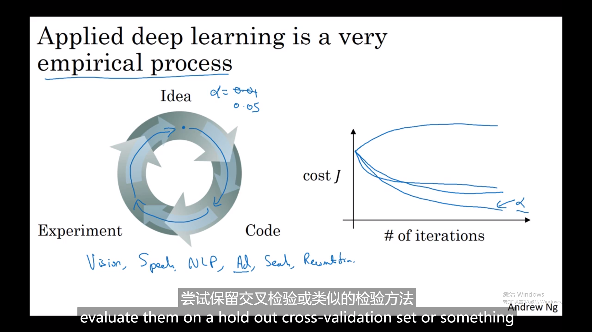

# 深层神经网络

## 1. 概览--长啥样

## 2. 前后向传播

最外环计算导数，dl/da == da[l]，输入da[l]输出da[l-1],dw[l],db[l]

### 2.1 总结

从输入x，一步步到L,最后计算da[l]再往前传导，

计算出的cost是标量，dA[l]由m个样本合计贡献,水平堆叠，哪个样本贡献的由哪个样本出

### 2.2 前向传播

向量化的结果不过是水平的堆叠起值

然后for循环推进--层数

#### 2.2.1 前向传播中维度的检查

##### w和b的维度

w[l]和b[l]的维度，w[l]维度不随增加m个样本变化：（n[l],n[l-1]）

##### z和a的维度

 

Z,A, dZ, dA的维度

### 2.3 反向传播

**输入** cache z

**输出**

已知da[l]借助w[l],b[l]，dz[l] (需要计算的 )输出da[l-1],dw[l],db[l]

信息传递的cache

**更新**

有了这些dw[l]

在每一层的w就能更新，完成了一个**梯度下降循环**

## 3. 为什么深层

### 3.1 intuition

从小面积的细节入手（边缘）-->鼻子嘴（细节特征）-->组合到人脸

 音频-->pitch,silasila的识别-->c a t每个字母-->words-->sentence

电路理论解释更深的原因    

若单层则需要穷举指数级别的单元，不允许深度的情况下

## 4. 超参数介绍（后续课程详介）

α，迭代次数，层数，uinits的数目，激活函数选择，momentum，minibatch size，正则化

试不同的值看cost的变化收敛发散的速度

## 5. L1W4 作业 搭建自己的深度网络

###  作业大纲

- 初始化两层的网络和L层的神经网络的参数。
- 实现正向传播模块（在下图中以紫色显示）。    - 完成模型正向传播步骤的LINEAR部分（Z[l]）。    - 提供使用的ACTIVATION函数（relu / Sigmoid）。    - 将前两个步骤合并为新的[LINEAR-> ACTIVATION]前向函数。    - 堆叠[LINEAR-> RELU]正向函数L-1次（第1到L-1层），并在末尾添加[LINEAR-> SIGMOID]（最后的L层）。这合成了一个新的L_model_forward函数。
- 计算损失。
- 实现反向传播模块（在下图中以红色表示）。   - 完成模型反向传播步骤的LINEAR部分。   - 提供的ACTIVATE函数的梯度（relu_backward / sigmoid_backward）   - 将前两个步骤组合成新的[LINEAR-> ACTIVATION]反向函数。   - 将[LINEAR-> RELU]向后堆叠L-1次，并在新的L_model_backward函数中后向添加[LINEAR-> SIGMOID]
- 最后更新参数。

### 作业地址：

https://www.kesci.com/home/project/5dd798fbf41512002ceb38de

## 6. L1W4 作业2 深度神经网络的应用

### 作业地址

https://www.kesci.com/home/project/5dd7a246f41512002ceb3d6b