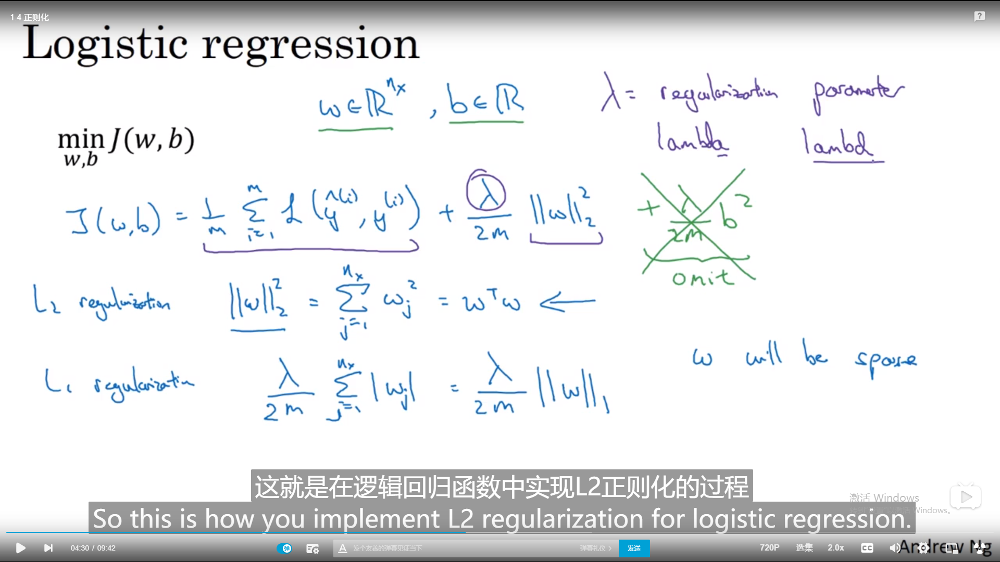
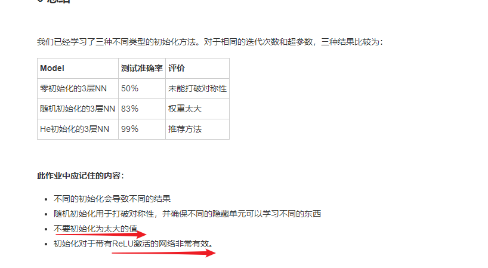
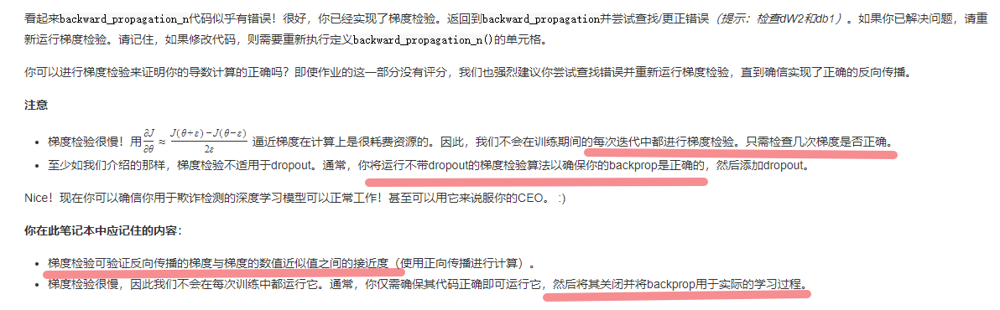

# 神经网络实操

## 1. 测试_开发--验证集

**小数据量 7/3或者 6/2/2**

**大数据 98/1/1  99.5/.25/.25都是可以的**

training可能是精良的cat图片，而dev/train图片则是随意拍摄的

验证集dev和测试集test要是一个分布

**原因**：因为验证集dev是算法模型的无偏评估因此验证dev和test同一分布较好

test的**作用**：对最终选定模型的无偏评估

如果只有dev，not test（因为已经**fit data to dev set，no longer gives you an unbiased estimate** )

## 2. biased and variance

### 2.1 几种情况

underfitting

just right

overfitting

二维数据中可视化分割边界，方差偏差但是**高维数据**可以用指标研究

可以查看train set/dev set的error查看variance和bias的偏置，但是

### **2.2 基于的假设** 

1.都是基本误差很小，若本就模糊，误差有15%则第二个模型是好的

2.测试验证来自同一分布

### 2.3 特殊的可视化high bias /variance

**原因**

1.本是线性不是合适的曲线因此high bias，**并未很好的拟合数据**

2. 在部分点过拟合了错误的样本

### 2.4 解决bias和variance差别的方案

high bias意味着没有拟合好，-->需要bigger network，通常data的数量此时无用

high variance意味着dev上效果不好，可能是过拟合了。因此需要大量的data

在现代bias variance 的trade off很少发生，可以bigger network的同时降低bias又不至于升高variance

#### 2.4.1  正则化

###### logistic regression例子

L1,L2正则化解决high variance，也就是泛化能力，lambd代替python关键词lambda

目的

增加惩罚项描述小影响，尽量简单的假设

lamda过大欠拟合，惩罚设置的太大了

###### neural network例子

l2正则化的更新权值过程，范数

dw被替代，l2正则化也叫权重衰减，乘以<1的系数-alpha倍

#### 2.4.2 L2正则化防止过拟合原因

**直观理解**

正则化： 从右到左减少了很多hidden units，变0去压缩范数

简单的深度网络会变成high bias情况

**具体例子**

tanh（z)，lamda选取的高则j尽可能小，w小只用到线性的性能不会去用非线性的性能。

整个网络边界就如同线性一样简单

#### 2.4.3 dropout regularization

每对一个样本，都采用一个精简后的神经网络训练它

例子：反向随机失活

因为rand生成0-1分布的均值所以随机失活0.8 

multiply作用过滤0的元素，对应元素相乘。而且d3是bool数组

除以0.8的原因是不影响z[4]的均值，a[3]的期望不变

**总结**

对不同的training examples,随机失活的也不同

对不同次数的，有可能需要每次失活的是相同的单元，第二次可能就会对不同units隐藏。对fore和back都成立

##### 附：np.random.randn()与np.random.rand（）

​	在-1.96～+1.96范围内曲线下的面积等于0.9500（即取值在这个范围的概率为95%），在-2.58～+2.58范围内曲线下面积为0.9900（即取值在这个范围的概率为99%）.
因此，由 np.random.randn()函数所产生的随机样本基本上取值主要在-1.96~+1.96之间，当然也不排除存在较大值的情形，只是概率较小而已。

**应用场景**：在神经网络构建中，权重参数W通常采用该函数进行初始化，当然需要注意的是，通常会在生成的矩阵后面乘以小数，比如0.01，目的是为了提高梯度下降算法的收敛速度。
W = np.random.randn(2,2)*0.01

[np.random.rand(d0,d1,d2……dn)](https://docs.scipy.org/doc/numpy/reference/generated/numpy.random.rand.html)
注：使用方法与np.random.randn()函数相同
**作用：**
通过本函数可以返回一个或一组服从**“0~1”均匀分布**的随机样本值。随机样本取值范围是[0,1)，不包括1。
**应用：**在深度学习的Dropout正则化方法中，可以用于生成dropout随机向量（dl），例如（keep_prob表示保留神经元的比例）：dl = np.random.rand(al.shape[0],al.shape[1]) < keep_prob

**在test time no drop out** 

理论上可以run 很多次prediction times，但是结果基本相同

而且不需要尺度参数，不改变预期

#### 2.4.4 dropout为什么有用

1.通过失活，dropout达到收缩权重的平方范数的效果

2.主要在cv应用，因为数据量总是不够存在过拟合

3.cost j 函数的意义不明，不会出现单调减，此时关闭dropout

#### 2.4.5 其他正则化的方法

##### data augmentation

数据扩充虽然没有independent的信息但是确保还是这个图

##### early stopping

**机理：**开始的w都很小==0，选择了较小的w，随着迭代w增大。找出中间值的w去

优点：耦合的解决了一系列的问题，不需要hyper parameters的试错

缺点：不能正交化，先optimize，然后防止过拟合，牺牲了optimize J的次数

## 3.神经网络从输入到backprob

### 3.1 归一化输入

**dev和test的也**都是通过相同的数据转换，training set得到的均值和方差

**原因**

确保所有特征都在相似范围内，从任何点出发都可以达到直逼min J的效果

### 3.2 梯度消失与爆炸

**问题直观理解**

以选择更明智的初始化函数

backwards的时候会非常的mini step

L深层指数级增长或下降

#### 3.2.1 解决方法

1.不希望z过大，n越大希望wi越小，有用的一个方法就是设置variance of wi = 1/n

即是：w初始化的时候乘以np.sqrt(1/n[l-1])  (当g(z)=relu(z) )

2.其他激活函数，调参方差这个超参数的优先级较低

### 3.3 传播时的梯度检测

#### 3.3.1 梯度的数值逼近

**结论**：双边逼近的O()更小，为平方项

#### 3.3.2 神经网络的梯度check

对于给定的样本，原本J是w1....wl的函数，现理成大函数theta，dtheta和J的梯度的关系

对于每个i，（对应每层的b,w）都计算梯度的正确，计算范数和欧式距离的比值看10^-5

1.不要在training阶段用

2.如果dw，db的问题好定位

3.正则化的时候记得把lambda项一起算

4.可以确保grad计算正确后再用dropout

5.w，b在接近0的时候正确backprob，越大越不准，在初始化grad check，w,b一段时间远离初始的很小的值，然后训练一段时间后再grad check

## 4. 作业

作业链接：https://www.kesci.com/home/project/5dd4f8d600b0b900365fb09f

### 4.1 L2W1作业1 深度神经网络的初始化

明显的第二个决策边界比较好

### 4.2 正则化

#### 4.2.1 L2正则化

正则化backprob过程的添加项数dw的改变需要添加项数

**L2正则化的原理**：

L2正则化基于以下假设：权重较小的模型比权重较大的模型更简单。因此，通过对损失函数中权重的平方值进行惩罚，可以将所有权重驱动为较小的值。比重太大会使损失过高！这将导致模型更平滑，输出随着输入的变化而变化得更慢。

**你应该记住** L2正则化的影响：

- 损失计算：
    \- 正则化条件会添加到损失函数中
- 反向传播函数：
    \- 有关权重矩阵的渐变中还有其他术语
- 权重最终变小（“权重衰减”）：
    \- 权重被推到较小的值。

#### 4.2.2 dropout

每一次iteration都是shut不同的，每一个样本也是（因为乘以了D列向量矩阵）

对D的操作1.向量化 2.阈值处理调0/1 x=(x<0.5)

对A的操作 3.关闭A的神经元 4.A与dropout相同期望值

1.用同样的D去关闭神经元

2.scale value

#### 4.2.3 gradient checking

借助字典to向量/向量to字典

是把x固定，把w，b当作参数去做一次传播中的梯度检验

