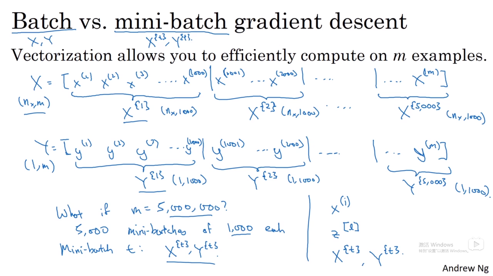
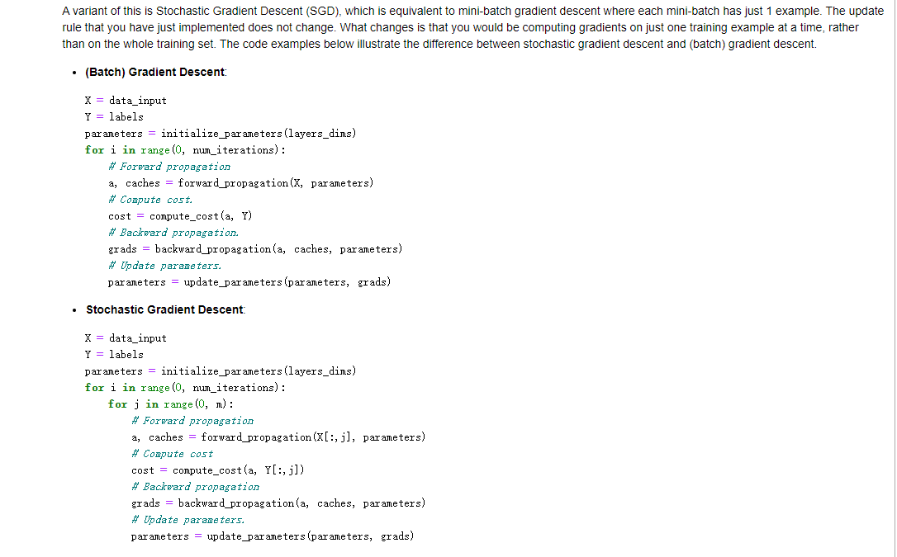

# 加速神经网络

## 1.Mini-batch梯度下降法



每次同时处理一个batch training set


每次用一个不同mini batch的1000个样本训练去更新权值，所有5000个走完称为一个epoch

### **1.1作用原理**


两种极端情况：size = m,遍历样本才下降一次

size = 1，stochastic gradient decent

in- between最合适，在最小值附近波动，但是可以减小learning rate来逼近

### 1.2 如何选择batch-size

因为计算机内存布局和访问方式，2的几次方


1.取决于训练量<2000用batch

2.因为计算机内存布局和访问方式，size用2的几次方（<1024）

3.fit进cpu/GPU内存

## 2.先导知识：指数加权平均

### 2.1 例子概念


1.每日的温度，

意味着trends ，local temperature平均值，考虑前一次v的系数和当日的温度

2.0.98平均了更多天的温度，波动更小，但是曲线右移，在温度变化时候不敏感

3.更多noisy，outliers，但是更快适应温度

选取beta超参数更好平均

###  2.2 深入理解指数加权平均


1.每日温度与指数衰减函数相乘然后求和

2.所有theta前的系数加起来逼近1

3.像计算加权平均数只关注了过去10天的温度，因为过去10天权重不到当日的1/3


正式使用中vtheta就行

机器学习**常用的原因**：repeat 1 line of code,

只占单行数字的存储和内存，不断覆盖即可

相比于计算过去50天/50，要保存过去50天的和（计算成本高+高内存）

### 2.3 bias correction


1.加上（1/1-beta^t）让紫线初期就和绿线重合，

2.去拟合，大部分时候不在乎偏差修正，熬过初期

## 3.其他梯度下降法

### 3.1 动量梯度加速

 **概念**

###   

1.**intuition**：把某一点比作小球，dw是加速度，vdw是之前的速度，beta是阻尼系数防止球无限制的加速，不适合碗状态函数

2.**原理**：将原先gradient decent的梯度值平均了：
保证竖向的oscillation小，横向加速度大了，加速了到达红线最小值


1.左边的公式更常用，右边调参beta还需要调alpha，右边相当于vdw乘以1/（1-beta)，要相应调alpha乘以1-beta

2.beta=0.9有很好的鲁棒性和性能

### 3.2 RMSprop


1.知道哪些参数的摆动大才能实施，比如b可以是w3，w4，w可以是高纬度的w1，w2，w7等等

2.rms又叫均方根，微分平方后大的除以大的减轻摆动，小的除以小的加速，分母不是0加kesy

### 3.3 Adam加速算法

#### 3.1 概念


1.结合了momentum和rmsprop

2.前提在mini-batch，iteration t次，一定要bias correction，

3.证明更范化的算法

#### 3.2 hyper parameter choice


1.一般默认beta1调整第一矩dw，beta2调整dw平方称为第二矩超参数只调alpha

## 4.learning rate decay

随着时间慢慢减少学习率

### 4.1 第一种公式


1. 1 pass是一个epoch，decay rate是另一个超参数
2. 这里从2开始少写了0，alpha单调减少

### 4.2 其他衰减 指数/离散下降


手动调参只有模型数量小的时候有用

2.好好调一个alpha有用，decay优先级不高

## 5. 局部最优问题

### 5.1 遇到鞍点


1.如果想达到局部最优，20000个所有方向都必须是凸函数

2.更可能遇到saddle point（鞍点），一些方向凸，一些凹，并不是局部最优（虽然此点导数为0）

### 5.2 遇到平台期


1.因为是高纬度，所以不太可能所有方向都是

# 作业L2W2

## 1. 随机梯度下降法



以上code证明了SGD和gradient descent的差别：for j in (0,m)


3个for loop


## 2. mini-batch梯度下降

1.shuffle（打乱）


对应的

2.partition（分割）


```python
def random_mini_batches(X, Y, mini_batch_size = 64, seed = 0):
    """
    Creates a list of random minibatches from (X, Y)
    
    Arguments:
    X -- input data, of shape (input size, number of examples)
    Y -- true "label" vector (1 for blue dot / 0 for red dot), of shape (1, number of examples)
    mini_batch_size -- size of the mini-batches, integer
    
    Returns:
    mini_batches -- list of synchronous (mini_batch_X, mini_batch_Y)
    """
    
    np.random.seed(seed)            # To make your "random" minibatches the same as ours
    m = X.shape[1]                  # number of training examples
    mini_batches = []
        
    # Step 1: Shuffle (X, Y)
    permutation = list(np.random.permutation(m))
    shuffled_X = X[:, permutation]
    shuffled_Y = Y[:, permutation].reshape((1,m))

    # Step 2: Partition (shuffled_X, shuffled_Y). Minus the end case.
    num_complete_minibatches = math.floor(m/mini_batch_size) # number of mini batches of size mini_batch_size in your partitionning
    for k in range(0, num_complete_minibatches):
        ### START CODE HERE ### (approx. 2 lines)
        mini_batch_X = shuffled_X[:, k * mini_batch_size : (k+1) * mini_batch_size]
        mini_batch_Y = shuffled_Y[:, k * mini_batch_size : (k+1) * mini_batch_size]
        ### END CODE HERE ###
        mini_batch = (mini_batch_X, mini_batch_Y)
        mini_batches.append(mini_batch)

    # Handling the end case (last mini-batch < mini_batch_size)
    if m % mini_batch_size != 0:
        ### START CODE HERE ### (approx. 2 lines)
        mini_batch_X = shuffled_X[:, num_complete_minibatches * mini_batch_size : m]
        mini_batch_Y = shuffled_Y[:, num_complete_minibatches * mini_batch_size : m]
        ### END CODE HERE ###
        mini_batch = (mini_batch_X, mini_batch_Y)
        mini_batches.append(mini_batch)

    return mini_batches
```

## 3.momentum

冲量可以减少朝着最小的震荡


主要是考虑了过去的梯度以平滑更新

1.初始化v，返回字典


## 4. Adam


初始化Adam


更新


