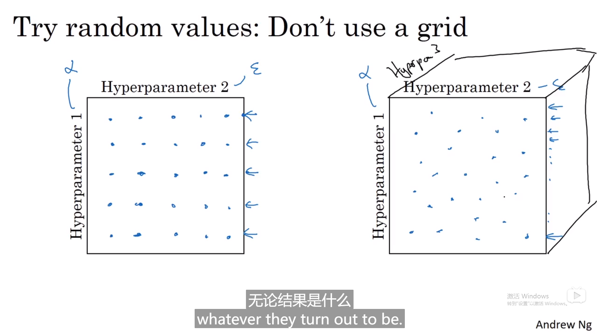
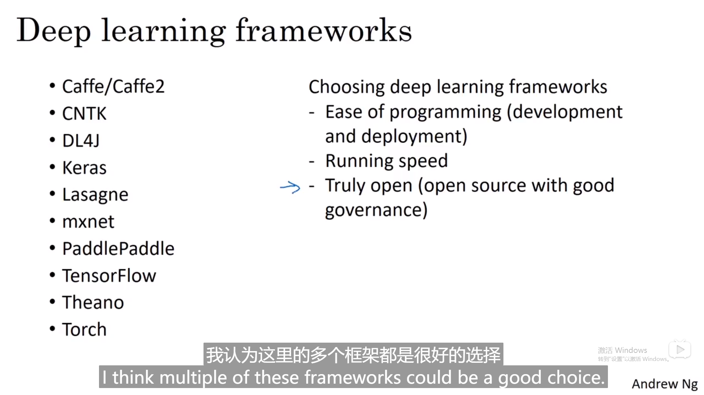
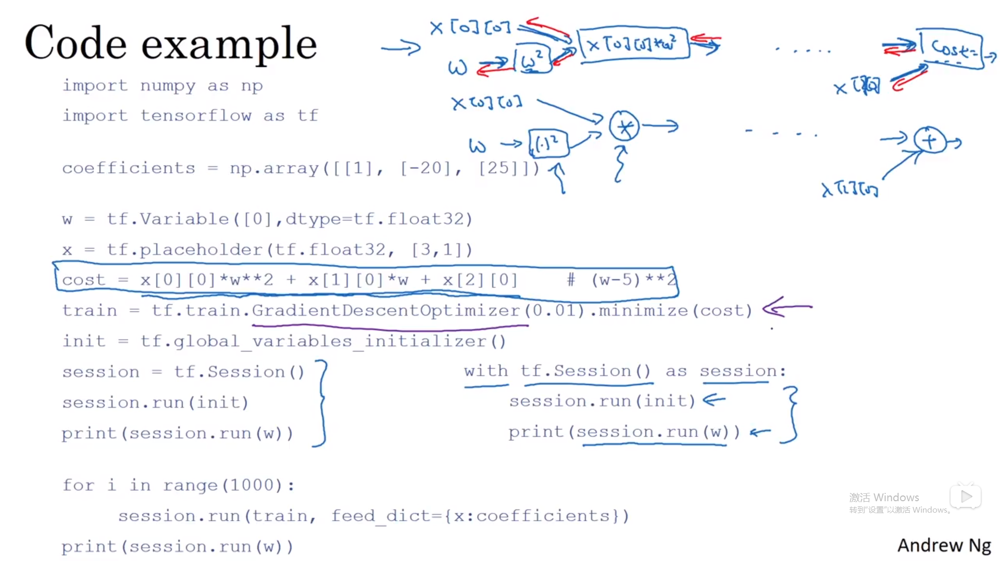

# Tensorflow

## 1. 超参数

### 1.1 调试选择策略（参数与参数间）

**优先级**


1.优先级alpha最高，其次橙色的beta，隐藏单元，batch-size

再次是紫色，最后Adam蓝色通常不动

调试**选择**



1.不要grid，因为α和kesi（不重要）的值只有5个有意义的alpha，随机有25个

**策略**：由粗到细部search更多


### 1.2 为超参数选择合适的范围

#### 1.2.1  α的选择


uniform random取值 


对数轴上取值过程，（对α)

**核心**：设置uniform random在（a,b)，10^a^ - 10^b^ 就是对数坐标轴，更多资源search在10^-4^

-- 10^-3^里

#### 1.2.2 beta的选择

 

1. 1/（1-beta）公式决定了平均多少个样本，
2.  平均取样不可能的原因：需要更多search资源在beta接近1的时候因为在接近1时更敏感
3.  1-beta = 10^r^

### 1.3 tips for超参数搜索过程

1.多看其他领域寻找灵感


2. babysit ing （多用于cv，大量数据）vs caviar strategy 取决于有多少算力。一个平行train一个训练一段时间加速（）

## 2. Batch Normalization

优点：

1.对超参数选择更加稳定

2.超参数范围更庞大

3.容易train深度网络

### 2.1 概念


1. 归一化inputs能让网络由椭圆变圆，
2. 所以目标是normalize a^[2]^去train w^[3]^,b^[3]^.  一般归一化z，不需要去归一化a


 gama 俩参数作用：不想让隐藏单元总是含有平均值0和方差1


通过赋予gama，beta值可以构造其他平均值和方差的隐藏单元值

以便更好地利用，非线性sigmoid的性能

### 2.2 深度网络层的拟合

#### 2.2.0 在网络层


1.batch的过程在于网络种红线的部分，后面的z代替前面原始z去 激活a

2.同样beta可以被学习像gradient decent一样

3.应用时只需1 line，不必自己实现


#### 2.2.1  和mini-batch一同使用


1.第二个batch用的是第二个的均值和方差

2.因为b[l]总是被减去的，加上的任何常数都会被均值减法所抵消，beta[l]控制转移偏置条件

维度因为是scale用所以也是（n[l],1）、

#### 2.2.3 总结在网络训练中的过程


### 2.3 为什么batch-norm奏效

#### 2.3.0 intuition

1.通过归一化所有的特征输入值x，来获得类似范围的值可加速学习

直观理解doing similar things

2.可以使得权重later deeper than your network（例如第10层权重更能比第一层受得住变化）


1.左边的黑猫数据很难模拟出真实的绿线边界，

#### 2.3.1 covariant shift

covariant shift==（如果学习了x-y的映射，x分布变了，要retrain learning algorithm，同样适用于ground true function保持不变正如猫中的例子）


前层的w1,b1,w2,b2 change对于第三层隐藏层a[1],....a[4]一直在变


但是batch norm保证了即使z1，z2值一直变，它的方差和均值都可以强制是0，1

govern by zelta2,gama2

限制了前层的参数更新给z数值的分布影响去让后层网络适应的程度，让后层网络稍稍独立于前层自己学习

#### 2.3.2 有轻微正则化的效果


1.因为在mini batch上做均值方差所以噪音大

2.z[l]到z~[l]过程也有噪音因为第一条，在隐藏层加了noise

3.加了噪音使得后面的神经元不过分依赖，如果mini-batch size过大就会减少噪音，减少了正则化效果

### 2.4 test time的batch norm

需求：test time不可能一次性处理mini batch中6000+的方差和均值，是一个一个样本run的

所以要单独估算方差均值

估算所有batch的均值和方差用指数加权平均去调整一个个例的


## 3. Softmax回归

### 3.1 基本概念 

概念


具体过程


forward传播中的过程z[l],然后t临时变量再到输出a[l]


实质不加隐藏层，线性空间的分割。（like logistic)


### 3.2 训练一个softmax

#### 3.2.0 理解softmax


1.hard max 最高1其余0

2.C=2退化成logistic回归，另一个冗余

#### 3.2.1 softmax损失函数


1.尽可能使损失函数小，y大，尽可能接近真实的类别的1

是最大似然估计,所有样本的均值

2.向量化之后的维度（4，m)

#### 3.2.2 gradient descent with softmax


只需管好前向传播，框架会自动搞定后向传播

## 4.深度学习框架

### 4.1 介绍



### 4.2 Tensorflow

#### 4.2.1 启发问题


w优化目标，cost代价函数，train训练算法

w初值是0，run（train）是一次

init是全局变量，只需搞定forward prop，其他求导tensorflow自己会求


若最小化到函数是训练集的函数，x控制了最小化函数，（成为了二次函数系数的数据）


placeholder是之后会赋值的变量，便于把训练数据加入损失方程

feed_dict 每次迭代需要插入不同的mini-batch

#### 4.2.2 核心：计算图



计算图画出，然后自动计算backprop

## 5.Tensorflow 作业

链接：https://www.kesci.com/mw/project/5dde48f6ca27f8002c4a8396

### 5.1探索tensor库

TensorFlow中编写和运行程序包含以下步骤：

1. 创建尚未执行的张量（变量）。
2. 在这些张量之间编写操作。
3. 初始化张量。
4. 创建一个会话。
5. 运行会话，这将运行你上面编写的操作。

```python
y_hat = tf.constant(36, name='y_hat')            # Define y_hat constant. Set to 36.
y = tf.constant(39, name='y')                    # Define y. Set to 39

loss = tf.Variable((y - y_hat)**2, name='loss')  # Create a variable for the loss

init = tf.global_variables_initializer()         # When init is run later (session.run(init)),
                                                 # the loss variable will be initialized and ready to be computed
with tf.Session() as session:                    # Create a session and print the output
    session.run(init)                            # Initializes the variables
    print(session.run(loss))                     # Prints the loss
```

创建tensor没有初始化，一定要含有tf.Variable的环境下，因为tf中建立的变量是没有初始化的，也就是在debug时还不是一个tensor量，而是一个Variable变量类型


不创建会话只是放计算图，占位符


### 5.2 搭建神经网络

#### 5.2.1 线性函数


#### 5.2.2  计算sigmoid


计算sigmoid

1.创建占位符
2.指定运算相对应的计算图
3.创建会话
4.如果需要指定占位符变量的值，使用feed字典运行会话。

#### 5.2.3 计算损失


1.建立占位符，等下传值的。

2.建立损失函数

3.创建session

4.运行session cost = sess.run(cost)

5.close,并且返回cost

#### 5.2.4 用独热编码


- tf.one_hot(labels, depth, axis)


### 5.3 建立自己的神经网络

#### 5.3.0 问题陈述


手势识别

#### 5.3.1 前处理


#### 5.3.2 创建占位符

方便后续传值


问好是你要输入的样本数目m

#### 5.3.3 初始化参数


#### 5.3.4 tensorflow中的前向传播


#### 5.3.5 计算cost


#### 5.3.6 建模