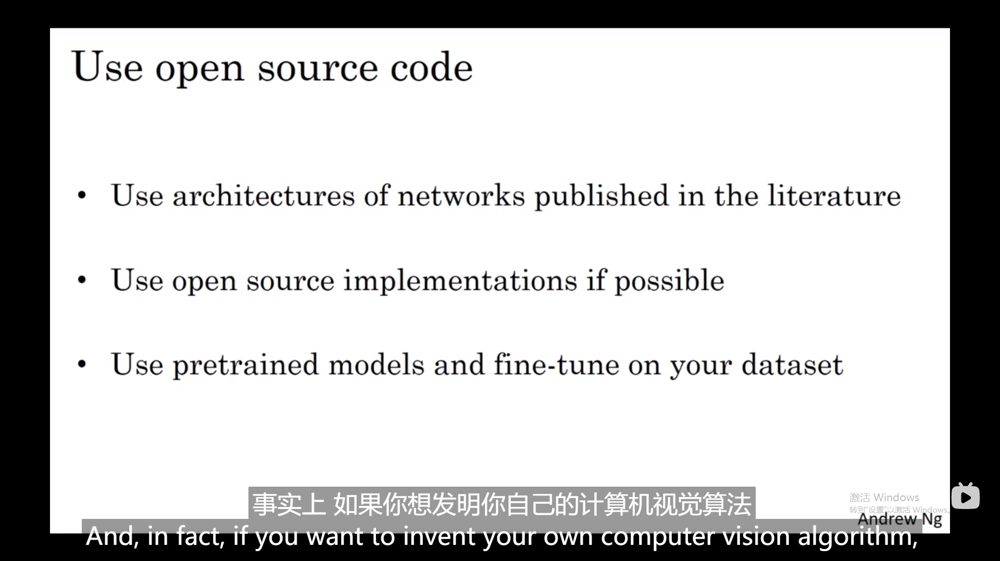

# 实例网络讲解

# 1.LeNet-5

1.迫于当时的计算条件信道数量选择的一样

2.60k参数每过一层都是nh，nw下降，nc上升。

3.精读2，3段，pool之后采用了非线性函数sigmoid/tanh

# 2.AlexNet

1.60million参数

2.LRN不需要太高的激活值，后面废弃

3.用了relu激活。

# 3.VGG-16

1.信道数翻倍，所有的conv layer是same conv

2.高宽缩小一倍

3.1.38亿的参数，图像缩小比例和信道增加的比例是有规律

# 4. ResNet

1.远跳连接，梯度消失和梯度爆炸问题

从某一层获取激活之后迅速反馈给更深的网络层

## 4.1 残差块

1.能训练更深的网络结构，在非线性激活之前加上a[l]，是一条捷径，不是主路径

1.把plain net变成 resnet

2.现实是层数越多error越高

## 4.2 为什么resnet work

1.越深的网络效率会减弱

2.如果用了l2正则化或者权重衰减，w[l+2]和b[l+2]值会压缩，假设都为0

3.即使给网络加了这两层，效率并不逊色于更简单的神经网络（学习恒等函数对其来说简单）

加了残差快并不会影响网络的表现，hidden unit学到了多余特征肯定比原网络要好

4.大部分是same cov有着同样的维度，如果不是则用 ws（固定矩阵，padding为0），0填充a[l]

5.大部分same cov，plain net 大都是conv，conv，pool，conv，conv，pool。然后softmax进行预测的全连接层。也解释了z[l+2]+a[l]

# 5.卷积网络中的1*1卷积

## 5.1 为什么有用

1.作用是32个单元都应用了一个全连接的神经网络，全连接层的作用是输入32个数字，然后运用relu输出一个激活值。不同信道

2. 1*1卷积只是添加了非线性函数，可以让网络学习更复杂的函数

## 5.2 其中一个应用

1.对构建inception网络很有帮助

# 6.inception网络

## 6.1 动机

1.作用代替你来做决定过滤器大小，要不要加池化层，虽然网络结构更复杂但是表现却非常好

让网络自己学习它需要什么样的参数，采用哪些过滤器的组合

2.计算成本是需要考虑的

## 6.2 用1*1的卷积计算成本对比

5*5的conv layer的计算成本，构建瓶颈层

## 6.3 inception module

ps：目的将这些层拼接到一块，pool层要用1*1卷积

分支通过隐藏层来做出softmax预测，防止过拟合

# 7. 实现方案

github download prototype

## 7.1 迁移学习

### tigger cat example

只需训练和你的softmax层有关的参数，前面的层数冻结

或者：直接取出x前面相当于固定函数直接映射到最后的激活函数，提前计算这一层的激活值save to disk，在此之上训练softmax分类器

小训练集的情况下

数据量大的情况下能够训练的层数越多，冻结的少

可以去掉后面的隐藏层或者加自己的softmax中等大小的网络

## 

## 7.2 数据扩增

### 随即裁剪和镜像翻转

RGB不同的失真值：根据实际中的某周概率分布来决定

使得学习算法对颜色改变更稳固

PCA主成分分析，如果RB主要绿色的变化就会相对少一些颜色增强的开源实现方法

pca 去吴恩达机器学习课程里又讲

### 利用cpu线程和gpu配合

cpu线程和training 并行实现，随即裁剪也有超参数比如说颜色变化多少等等

### 现状问题

相当复杂网络架构的有原因和更多的hand engineering是因为在缺乏更多的数据

有更多的特定组件

ensembling，平均他们的输出过程

跑10种crop的结果然后再平均它们

