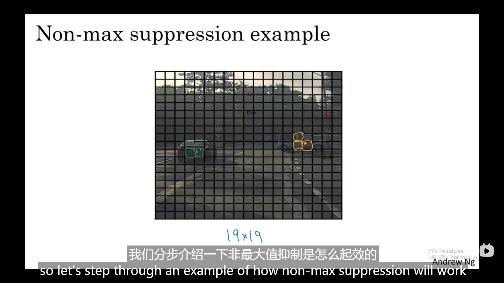
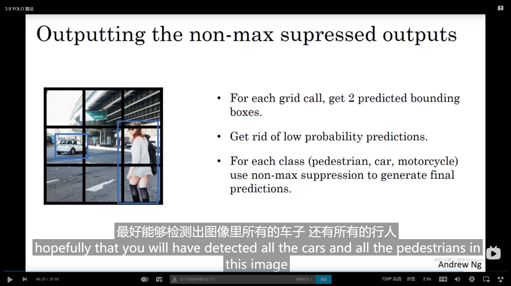
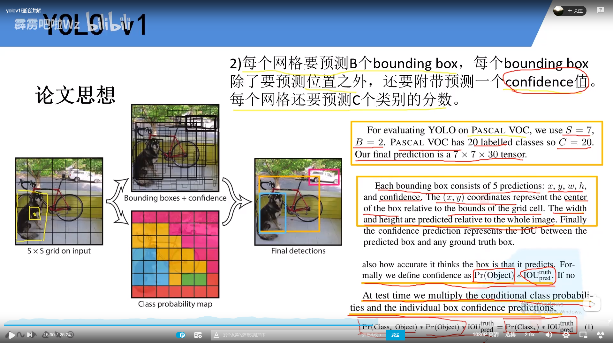
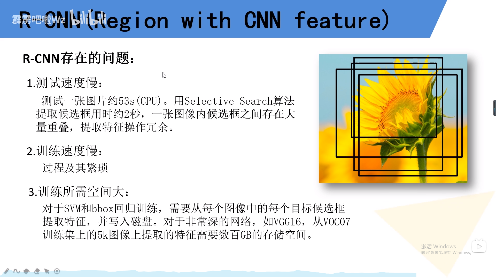
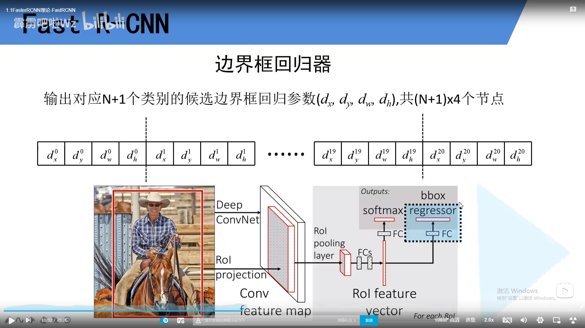
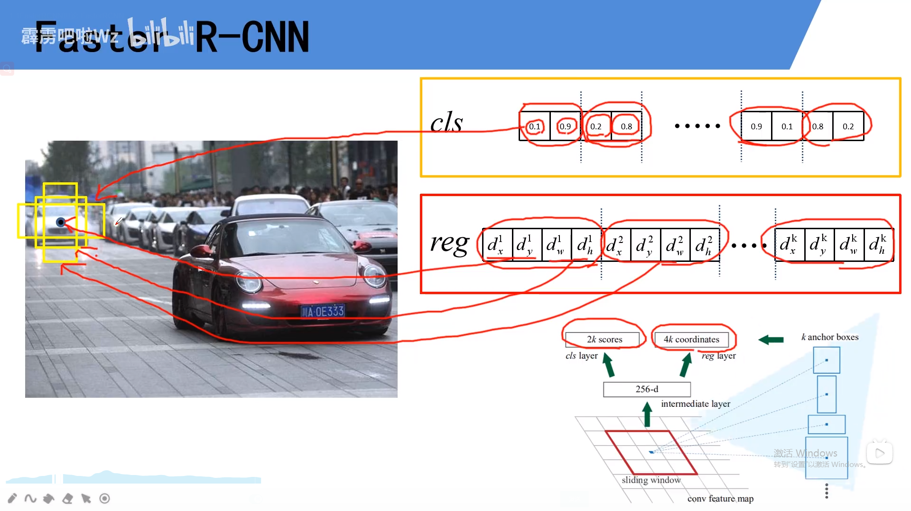

# 目标检测

## 1. 目标定位

分类位置的讲起

盒子的中心点和矩形面积，目标标签supervised

Y标签的样子

pc可以logistics，bx，by square error，c1

c2 c3用softmax对数损失函数误差 

## 2. 特征点检测

一个个标出特征点位置，识别表情等应用

## 3. 对象检测

适当剪切的图像样本

### 3.1 先训练classfication

### 3.2 滑动窗口目标检测

然后用滑动窗口目标检测

缺点是计算的cost很大，要遍历整个图像，太多的方片图卷积网络要一个个处理，步幅大会减少卷积网络窗口个数

所以以前多用，线性分类器 

### 3.3 卷积的滑动窗口实现

解决计算cost的问题，

#### **把全连接层转化成卷积层**

数学角度看和全连接层的效果是一样的，因为5*5**16个元素也是经过每个信道都产生一个输出值（上一层这些激活值经过任意线性函数的输出结果）（而通过输出值的正是一个conv在5516整个400个元素的一个运算相当于全连接的过程）

#### 实现滑动窗口对象检测算法

借鉴overfeat论文

中间share了很多重复的计算过程

不需要把图片分割成四个子集去分别执行向前传播，而是把它们作为一张图片输入给卷积神经网络进行计算

max pool的步幅为2相当于大小为2的滑动窗口一个个输入网络

有**缺陷**：边界框的位置可能不够准确

不能输出最精准的边界框

### 3.4 bounding box预测

#### yolo算法思路概括

1.让神经网络输出边界框，具备任意宽高比，并且能输出更精确的坐标。而不收到滑动分类器的步长大小限制

2.这是一个卷积的实现，处理计算中很多计算步骤共享，效率高。一个卷积实现可以达到实时识别

取两个对象中点，将这个中点分配给包含对象中点的格子。即使中点的各自有2个，我们假装中心格子没有任何东西

8维编码，输出是3*3**8的格式

3.优点在于可以输出精确的边界框，网格越精细分配到同一个各自的概率小得多

即使横跨多个网格也只会分配到9个格子的其中之一。显式的输出边界框坐标，可以输出任意宽高比和精确坐标，不会受到滑动分类器步长大小的限制。

4.问题在于如何编码bx，by，bh，bw都必须在0-1之间

sigmoid确定0-1之间，指数参数化保证这些都是非负数

### 3.5 评价目标检测算法

#### 交并比函数

0.5/0。6/0.7是阈值来判断预测的边界框是否正确

#### 非极大值抑制

确保算法只对每个对象只检测一次

19*19的格子附近格子都会觉得这个网络中有车

一辆车只检测一次，步骤：先看pc，找出pc值最高的那个部分，去掉其他lou值很高的矩形，使其变暗。现在每个矩形都会被高亮或者变暗，摒弃变暗的，只输出概率最大的分类结果，但抑制很接近但非最大的其他预测结果

##### 实操方法

对于单目标检测，对于没有摈弃的，while一直选择概率pc最高的边界框，输出成预测结果

接下来去掉所有剩下的边界框（没有输出成prediction的，有高交并比的

对于多目标，独立进行三次非最大值抑制，对每个输出类别都做一次

### 3.6 anchor boxes

让一个格子检测出多个对象，车人几乎在同一点，落在同一网格中，不会同时输出两个检测结果

首先预定义一些anchor box的形状，再让预测结果和anchor box联系起来

##### 和无anchor box的对象标签对比

对象不知分配到一个格子，而是分配到一对，对象标签

最高的loU

###### 具体例子

不要引入三个对象，或者两个对象的anchor box同样形状

需要choose anchor box的形状，或者k-means算法自动聚类选择有代表性的anchor box

### 3.7 对象检测组件聚合--Yolo

#### training

要构造训练集需要遍历9个格子，输出的向量是3*3 *2 *8

100*100 *3输入经过conv Net输出是实际中更偏向于19 * 19 *16/40（5个anchor box *8标签）

#### making prediction

输入网络输出一个这种下pc为1结构的向量

跑一个非极大值抑制的例子

9个格子中每个都有两个预测的边界框，可能pc很低而已，有些边界框可以超出格子的宽度和高度

然后抛弃概率低的预测，若有3个对象检测类别，然后对每个类别单独运行非最大值抑制。

### 3.8 R-CNN网络候选区域（两阶段）

#### 特色概念

1.因为在背景方面有太多无效的运算，选择区域去运行卷积神经网络的分类器才是有意义的

少数窗口去运行卷积网络分类器

首先运行图像分割算法，分割出不同色块，然后在这个2000多个色块上放置边界框，跑一下分类器

不仅是在方块区域运行网络，也会在各种尺度运行分类器

#### fast/faster R-CNN

**rcnn**每个输出output label + 边界框

特点是 ：不直接信任输入的边界框，也会输出一个边界框，比单纯图像分割算法给出的色块边界要好

**fast** rcnn 用的是滑动窗口的一个卷积实现，但是得到候选区域的聚类步骤仍然十分缓慢

**faster** **rcnn **用卷积网络而不是传统的分割算法来获得区域色块  速度仍然慢于yolo

但是都需要两阶段：1.候选区域 2.再分类

# 4. yolo

## 4.1 yolo v1

比不过ssd

### **效果**

confidence yolo独有，意思是预测目标与真实目标的交并比。v1无anchor的概念。faster rcnn和ssd四个值（x,y,w,h）是相当于anchor 的合规参数

### 论文思想

s代表grid cells， x,y相对值相当于小方格，矩形宽高相对于整个图像的相对值均属于（0，1）

最终给出的概率分数既包含某个目标的概率，也包含了预测边界框和真实目标的重合程度。直接预测的目标概率不一样

输出向量

### 网络结构

注意最后的展平和重塑

### 损失函数

分为三部分

bounding box损失宽高注意都是开平方的，偏移相等距离大小目标的差值都是一样而lou显然是不同的

confidence 损失，分为正（原盒子里有样本）负（i个网格中无样本）样本

类别损失classes损失

### 局限

1.因为每个cell都只预测两个bounding box，而这俩bounding box属于同一类别，对于每个grid cell预测一组classes参数。

2.小目标聚集在一起yolo v1检测效果很差。目标出现新尺寸配置，v1效果差

## 4.2 yolo v2

### 效果

2017年主流的网络对比效果 

### 尝试

7种

#### 1.BN层

减轻过拟合，可以不需要drop out 层

#### 2.更高分辨率的分类器

4百分点map

#### 3.基于anchor box的目标边界框

简化基于目标边界框预测的问题，map下降召回率提高

#### 4. 聚类（如何选择自己做anchor box）

k -means聚类去在训练集种选择我的anchor，这里叫做priors

#### 5. 目标边界框预测

参考faster-RCNN

sigmoid函数映射（0，1）限制了，偏移量进行了限制，anchor负责去预测目标中心落在某个grid cell的目标，不会出现下图情况

t(o) 是confidence

#### 6. pass through layer

在最终的预测特征图上结合更底层的特征信息，底层信息包含更多的图像细节（检测小目标所需要的），高层信息检测效果很差的，高层和低层的信息做融合

13*13 -> 26 *26的特征图，添加passthrough layer

#### 7.mutil-scale training

因为输入尺寸固定，418*418 ， 512 *512, 影响网络鲁棒性。每迭代10batch改变网络的输入图像尺寸大小

#### 8. faster章节 ，back bone：darknet-19

19个卷积层

#### 9.模型框架

conv层都是三部分构成：bn层不起任何作用，卷积没有偏置bias

darknet移除了最后的卷积层，保留了3*3 1024的卷积层，添加3个3 *3大小1024的卷积层

## 4.3 yolo v3

### 效果

堆叠残差结构和resnet-153没有太大区别，没有最大池化层，所有的都是下采样用卷积（步距2）做的

### 模型

整个框是一个残差结构，不是两个conv之后再接残差

## 4.4 yolo v3 spp

### 效果

focal loss版本特别多的trick不建议使用

### mosaic 图像增强

图像的随即裁剪，随机水平翻转，亮度色度饱和度的随机调整

**思想**：多张图片拼接，（4张图像拼接），随机选取4张图像组合

bn层batch size去求每一个特征层的均值和方差，batch size越大，求出的均值方差就接近整个数据集的，设备受限不能一次性训练这么多张图片

### 结构

唯一区别在于和darknet-53层的输出和预测特征层1之间加了一个spp结构（借鉴于spp网络）

16*16 *512 -->16 16 2048

局部融合了特征，后面继承，三个spp结构

### 损失

# 5. Faster-RCNN

ross 大牛

## RCNN 论文思想

 图片分类网络

### 候选区域的生成

主要是selective search

### 目标分类网络提取特征向量

### 输入svm分类器判定类别

上图单个送入svm分类器

2000个框*20个分类向量，概率矩阵

然后非极大值抑制剔除重叠的建议框，遍历一列的所有候选框的概率值，找出最大的iou相同则删除概率低的，认为是一个物体

### 回归器精修候选框位置

橙黄色是SS(selective search)算法所得到的目标建议框，**通过**回归分类器得4参数，x,y偏移量，w，h的缩放因子，回归后得红色

回归分类器针对的是2000*4096，20类别所以是20个回归分类器，维度的

### 存在的问题

冗余，训练三个分类器极其的慢，相互独立。

## Fast R-CNN

 将整幅图像输入CNN网络得到相应的特征图，将ss算法生成的候选框**投影**到特征图上

**每个**特征矩阵通过感兴趣区域pooling缩放到7*7大小的特征图

集合在一个网络中不需要分别训练回归器和svm分类器

### 一次性计算整张特征

参考SPP net，不需要冗余的2000次计算

#### 	数据采样

1.训练过程中并不是使用ss算法所生产的所有候选区域，2000个候选框，训练只要一小部分

2.分正负样本（正：候选框确实存在检测目标的样本，负样本：背景）全都是正样本，候选区域是检测的目标，正>>负，数据不平衡，更偏向于正

2000框采集64一部分正一部分负样本；候选框与真实的iou>0.5就是正样本，**随机采样**一部分，0.1-0.5之间的iou最大的负样本

### ROI pooling层 

无论得到的特征矩阵划分成7*7等分，对每个区域执行最大池化下采样的步骤，最终都保证缩放到  7 *7大小，所以**不去限制图像的输入尺寸**

### 分类器

这里是softmax分类器，有分布处理过：合为1

得到ROI vector的基础上并联两个全连接层，一个用于目标概率的预测，一个用于边界框回归参数的预测

边界框回归参数

要得到最终边界框的步骤

把橙色框调成红色的位置

### 损失计算

分类损失交叉熵损失

#### 交叉熵损失

#### 边界框回归损失

lamda平衡系数平衡边界框回归损失合分类器损失，艾弗森系数u>=1为1，候选区域确实属于所需检测的某一类别当中，对应的正样本才有边界框回归损失，u=0没有回归

### **瓶颈**

速度**瓶颈**在于ss算法，所需要的是把ss算法也集成到cnn网络中来

## Faster RCNN

### 效果

虽然fast-rcnn网络推理要0.几秒，加上ss算法还是要2.几秒，VGG backbone

### 流程

RPN + Fast-RCNN

fast是先ss算法再映射

### RPN

1.使用滑动在特征图上，每滑动生成一维度的向量，通过两个全连接层输出目标概率和边界框回归参数。2k的意思是一个背景概率一个前景概率，并没有分类

2.ZF网络为faster的backbone，channel为256

3.以滑动窗口的中心点去生成anchor（给定大小长宽比例的），可能包含了检测目标

前景0.1背景0.9，预测的偏移量

1.每个点9个anchor生成，2*9个类别分数，4 *9个回归参数

2.感受野为什么能预测比它大的目标的边界框，228 能预测256，512.作者看法：看一部份能预测完整的一个区域的

 

剩下的anchor利用RPN生成的边界框回归参数将anchor调整到候选框的，候选框用非极大值抑制去删除重叠的候选框。大概只剩下2000个候选框

#### RPN的实现

正向传播：滑动窗口3*3 stride 1 padding 1，feature map都一样的shape。特征矩阵再并联两个 1 *1卷积层，来实现

上万个anchor中采样256个anchor，正负样本1：1，

两种定义方式iou>0.7，或者某一个anchor与某一个ground truth有最大的iou

有可能所有的anchor都没有超过0.7

对于负样本：所有的ground truth 的iou值都小于0.3。正负样本之外的anchor全部丢弃

### RPN的Loss

lamda是平衡参数

#### 多类别交叉熵损失函数

输出是两个，多类别的softmax交叉熵损失

二分类的交叉熵损失输出数为1

#### 二值交叉熵损失只预测k个分数

#### 边界框回归损失

tx,ty这些是预测出来的，ty*是真实的

后面就是fast ——rcnn的计算的

#### faster ——RCNN训练

